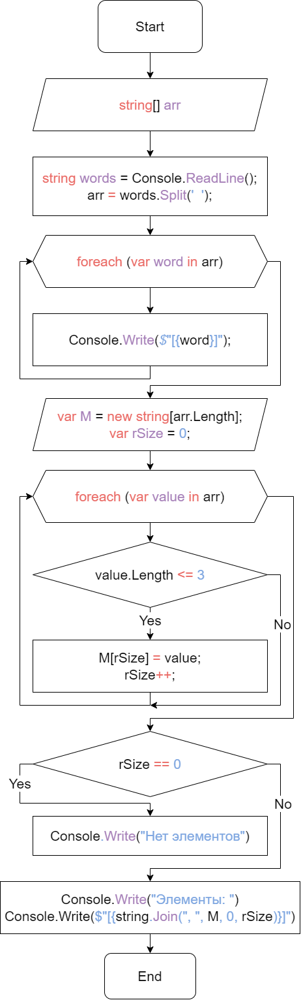

# Итоговая проверочная работа #
## Задача: ##
Написать программу, которая из имеющегося массива строк формирует массив из строк, длина которых меньше либо равна 3 символа. Первоначальный массив можно ввести с клавиатуры, либо задать на старте выполнения алгоритма. При решении не рекомендуется пользоваться коллекциями, лучше обойтись исключительно массивами.

### Алгоритм решения: ###

1. Даем возможность пользователю ввести свой массив
2. Разделяем слова на отдельные элементы
4. Проходимся по каждому элементу внутри массива
5. Записываем элемент в новый массив, если он соответсвует условию
6. Повторяем 5 пункт, пока в массиве не кончатся элементы
7. Выводим нужные слова

### Блок-схема алгоритма: ###

